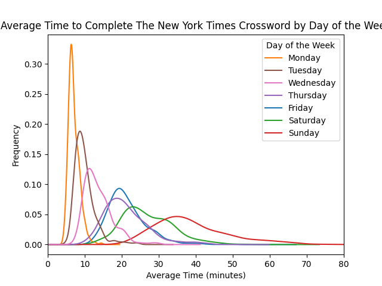
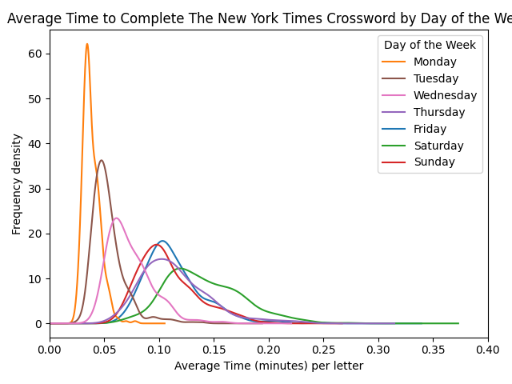

# Crossword Difficulty Estimator

The ultimate goal of this project is to develop a tool that, given a set of crossword clues and answers, estimates how long it would take an average crossword solver to complete the puzzle.

## Data Sources

The New York Times (NYT) publishes daily crosswords known for varying difficulty levels, dependent on the day of the week—Mondays are the easiest, while Saturdays are generally considered the hardest. Given the wide variety in puzzle difficulties and the availability of extensive historical data, I've chosen to focus specifically on analyzing NYT crosswords.

### Primary Data Source:
- [xwstats.com](https://xwstats.com/): This website allows users to track their crossword-solving times and provides aggregated data on average completion times (Global Median Solver) for each day's puzzle.

### Crossword Puzzle Data:
To acquire the actual crosswords (clues and answers), I'm primarily utilizing these two resources:
- [xd.saul.pw](https://xd.saul.pw/)
- [xwordinfo.com](https://www.xwordinfo.com/)

Throughout the project, I aim to minimize reliance on external data by replicating key metrics and methodologies found on these websites.

## Tools Used in this Project

- **`Crossword_difficulty_fetcher.py`**: Retrieves average crossword-solving times from [xwstats.com](https://xwstats.com/) and stores the data in `crosswords_hardness.csv`.
- **`Graph_creator.ipynb`**: Generates the graphs used in preliminary data analysis.
- **`Main_crossword_functions.py`**: Contains reusable functions utilized across various parts of this project.

## Preliminary Data Analysis from xwstats.com

Xwstats provides average crossword-solving time data dating back to 1995. However, data for earlier puzzles may reflect retroactive solves (i.e., puzzles solved long after their original publication dates), which could impact data accuracy and representativeness.

Analyzing average Wednesday crossword-solving times (see image below) shows that data prior to 2018 diverges significantly into three distinct groups. It's unclear why this divergence occurs—perhaps early puzzles attract specific dedicated solvers who dominate this subset of data. To ensure data consistency, subsequent analysis will exclusively use data from **2018 onward**.

Next, let's compare average crossword-solving times by day of the week:

As expected, Monday puzzles take the shortest time on average, while Sunday puzzles require the longest. However, puzzle length variation (number of letters required to complete each puzzle) could bias this comparison.

To address this, the average solving times were normalized by dividing by the number of letters required to complete each puzzle:

After normalization:
- Saturday puzzles now appear harder per letter, overtaking Sunday, which suggests Sunday puzzles' higher overall solving times are primarily due to puzzle length rather than difficulty per clue.
- Interestingly, Friday puzzles also surpass Saturday puzzles slightly in normalized difficulty, suggesting complexity per clue is somewhat comparable or occasionally harder on Fridays.
